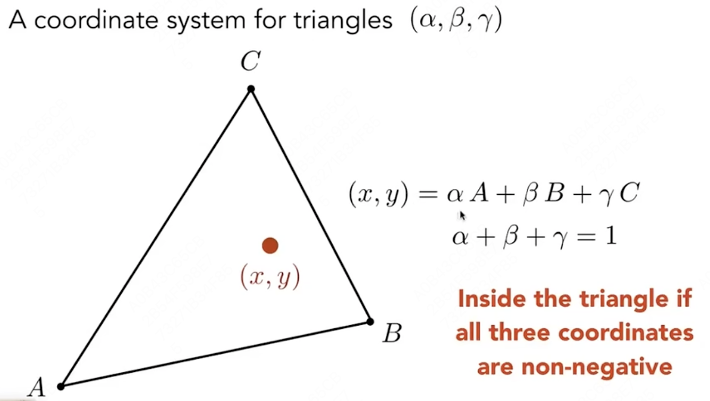
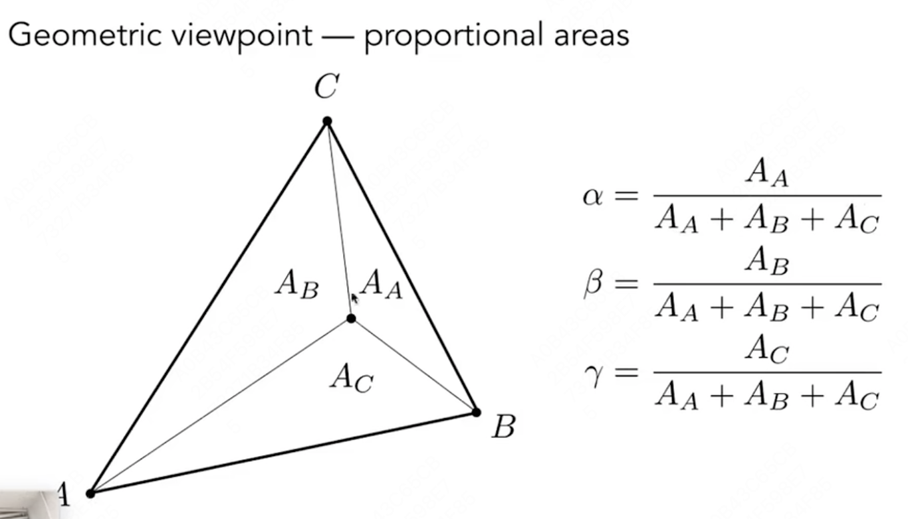
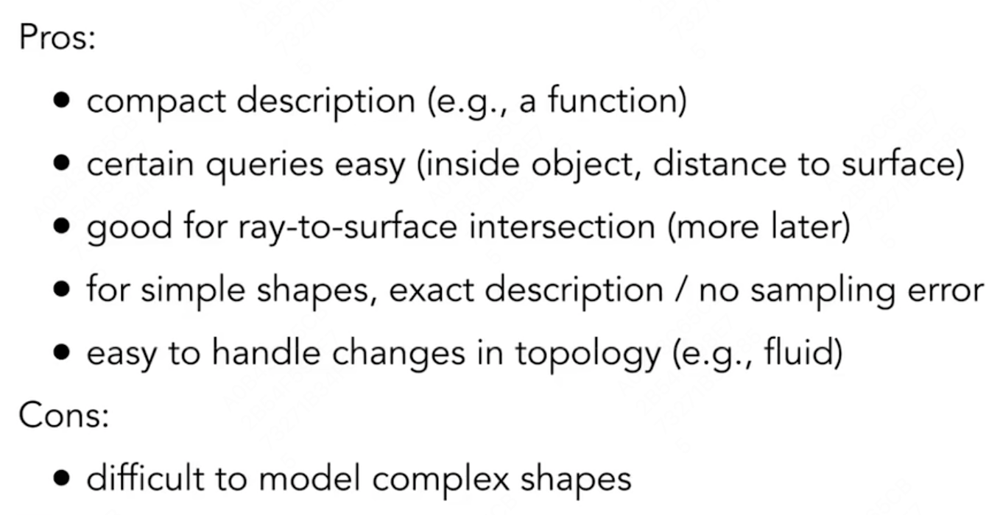
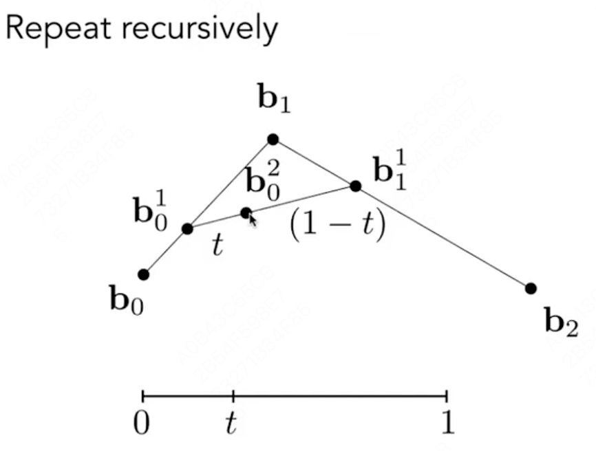
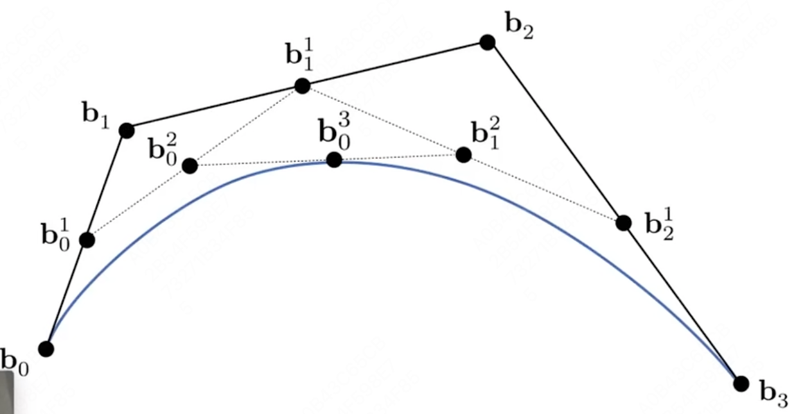

# GAMES 101：现代计算机图形学入门

课程网站：https://sites.cs.ucsb.edu/~lingqi/teaching/games101.html

本课程将全面而系统地介绍现代计算机图形学的四大组成部分：

1. 光栅化成像
2. 几何表示
3. 光的传播理论
4. 动画与模拟。

每个方面都会从基础原理出发讲解到实际应用，并介绍前沿的理论研究。通过本课程，你可以学习到计算机图形学背后的数学和物理知识，并锻炼实际的编程能力。

## Lecture 08 Shading 2 

###### Shading, Pipeline and Texture Mapping

 

### Texture Mapping

**Texture**定义**mesh**中任何一个点的**不同**属性，以来渲染出不同颜色、材质等。

三维mesh中每一个顶点都可映射到一个纹理坐标**（u, v）**，u, v ∈ [0, 1]。  映射有两种方法：

- 人工手动映射，由设计师、美工完成。

- 通过**参数化**方法实现自动映射。

图形学中，默认已经知道了映射方式。

在一个场景中，纹理可以进行多次重复映射，但是希望满足两片纹理之间衔接无突变，即纹理本身上下、左右无突变。 

## Lecture 09 Shading 3 

###### Texture Mapping Cont.

### Interpolation Across Triangles

##### Interpolation

通过三角形三个顶点的属性，来决定三角形内部某一像素点的属性，实现平滑过度。

可以对很多属性进行差值计算：纹理坐标、颜色、法向量······

##### 重心坐标（Barycentric Coordinates）

三角形所在平面中任意一点都可以用三点坐标的线性组合**（α, β, γ）**表示，即重心坐标；若**α, β, γ ≥ 0**，则此点在三角形内：

通过**面积**来求重心坐标：

**三角形重心**为$(α, β, γ) = (\frac{1}{3}，\frac{1}{3}，\frac{1}{3})$。

通过**坐标**来求重心坐标：

使用重心坐标**（α, β, γ）**进行差值：$V = αV_A + βV_B + γV_C$。 

注意，经过projection变换后，模型从三维变成二维，这个过程重心坐标会改变！故差值三维属性（深度，法向量等）时，应使用三维的重心坐标；差值二维属性（颜色，纹理等）时，应使用二维的重心坐标。

### Applying Textures

通过差值算出某个像素点的（u，v）坐标，将查找到的纹理值应用于渲染。

#### Texture Magnification 

A pixel on a texture — a texel（纹理像素），如果使用像素中心在纹理中的位置，会产生以下问题。

##### 纹理太小了怎么办？

导致查找到的纹理坐标为非整数，本质上是**点查询**（Point Query）问题。可以使用**双线性插值**（Bilinear interpolation），即选择坐标周围的四个像素点，通过（u，v）相对于四个像素点的相对距离（s，t），对颜色进行线性差值。

或者更好的**Bicubic**方法。

##### 纹理太大了怎么办？

会产生Moire纹的**走样问题**。因为如果在一个图片的远处，会导致一个像素覆盖了纹理中的很大一片。

可以使用超采样方法，但是算法复杂度过高，耗时多。

所以转换思路，本质上是**平均范围查询**（Avg. Range Query）问题，如何快速获得覆盖区域的平均值。

使用**Mipmap**，可以实现快速、近似、正方形的范围查询。实现原理对原始的纹理图进行长宽等比压缩，生成不同层次的纹理图，然后将像素对应到不同层次的纹理图中。额外多了1/3的存储量。

计算某一像素点的Mipmap层次：

通俗来讲，就是找到当前所求像素和它的邻近像素，通过它们的纹理像素距离，来判断当前所求像素的在纹理图中覆盖面积边长L，从而获得Mipmap的层次D。

如果想获得**非整数层**Mipmap的纹理值，通过**三线性差值**（Trilinear Interpolation）方法，即在上下两层分别进行双线性插值后，再进行差值。

但是会有缺陷，Overblur，导致远处的像素过于模糊，原因是Mipmap只能做正方形范围查询，但是像素映射不一定为正方形。

使用**各向异性过滤**（Anisotropic Filtering）进行长方形区域查询，即对原始的纹理图长宽进行非等比压缩，开销是原来的三倍。

### Applications of Textures

现代GPU中，纹理 = 内存 + 范围查询（过滤）。

- 环境光照：记录来自不同方向的光照信息。
- 凹凸贴图、法线贴图：不改变mesh，定义相对高度来改变法线。通过算梯度，来计算法线。
- 位移贴图（Displacement mapping）：改变现有mesh，定义真实高度来改变法线。要求三角面片足够细致，可以跟得上纹理变化。
- 三维纹理和体积渲染（3D Textures and Volume Rendering）：3D Procedural Noise
- Provide Precomputed Shading：使用纹理存储提前计算好的信息。

## Lecture 10 Geometry 1

###### Introduction 

### Ways to Represent Geometry

#### Implicit 隐式表示

给定一个关系 $f(x, y, z) = 0$ ，要求点满足这个关系。

eg. $x^2 + y^2 + z^2 = 1$，表示一个球。

- Algebraic Surfaces
- Constructive Solid Geometry：通过基本几何体的布尔运算。
- Distance Functions：可以将两个物体的距离函数混合，再恢复成原本的面。
- Level Set Methods：存储一个近似函数值的值网格。
- Fractals：分形，如雪花。

优缺点：

#### Explicit 显式表示

所有的点都直接给出，或者通过参数映射给出。

- Point Cloud：点云，(x, y, z) 的列表。扫描出来的基本为点云，考虑如何转换成mesh。
- Polygon Mesh：多边形面片。`.obj`文件，点、纹理坐标、法线、连接关系。

## Lecture 11 Geometry 2

###### Curves and Surfaces

### Curves（Bezier Curves）

使用一系列控制点（起始点、起始切线、结束点、结束切线）来定义一条曲线。

#### de Casteljau Algorithm

用于绘制一条Bezier曲线。

假设起始点$b_0$为时间0，结束点$b_2$为时间1，则对中间的某一时间t，可以按照n进行差值，从而找到一个确定的点$b_0^2$。

**Quadratic Bezier Curve：**

**Cubic Bezier Curve：**

#### Algebraic Formula（递归）

$$
b_0^1(t) = (1 - t) b_0 + t b_1\\
b_1^1(t) = (1 - t) b_1 + t b_2\\
......\\
b_0^2(t) = (1 - t) b_0^1 + t b_1^1\\
......\\
b_i^k(t) = (1 - t) b_i^{k-1} + t b_{i+1}^{k-1} 
$$

即：
$$
\mathbf{b^n}(t) = \sum_{i=0}^n \mathbf{b}_i B_i^n(t)
\\
B_i^n(t) = \binom{n}{i} t^i (1-t)^{n-i}
$$
其中$b_i$为控制点，n为控制阶数，$B(t)$为二项式系数（Bernstein polynomial）。

#### Properties of Bezier Curves 性质

- 曲线必定经过起始点、终止点
- 导数
- 不会受**仿射变换**（Affine transformation）影响，投影变换会受影响
- 凸包性质：画出来的曲线一定在控制点形成的凸包（Convex Hull，最小的外包多边形）内。

#### Piecewise Bezier Curves 逐段

在很多控制点存在的情况下，直接绘制可能会导致绘制不理想的情况。

每次使用很少的控制点（通常为4个），来逐段控制曲线。

##### Continuity

- $C^0 continuity$：$a_n = b_0$，保证点连接
- $C^1 continuity$：$a_n = b_0 = \frac{1}{2}(a_{n-1} + b_1)$ ，保证切线（导数）连续。

通常使用$C^1$连续：前一段终止点和后一段起始点的切线（由两个控制点形成的线段）长度和方向都相同。

#### Spline 样条

一个连续的曲线是由一系列控制点决定的，在任意一点都保证连续性。

##### B-splines / basic-splines

考虑到局部性的Bezier Curves。

### Surfaces（Bezier Surface）

在两个方向同时应用Bezier Curve的方法，即在水平方向得到一系列水平Bezier Curve，然后在竖直方向通过水平curve获得的点得到一系列竖直方向的Bezier Curve。

