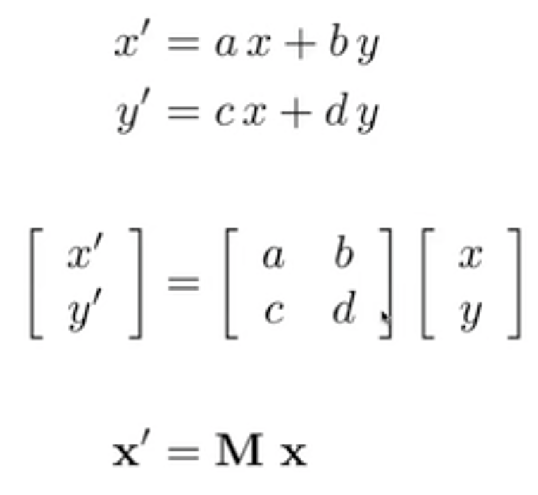
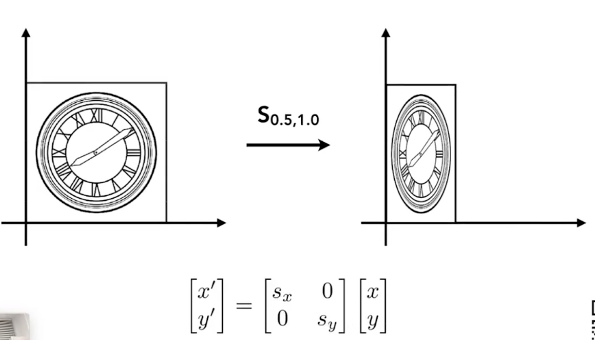

# GAMES 101：现代计算机图形学入门

## Rasterization部分

课程网站：https://sites.cs.ucsb.edu/~lingqi/teaching/games101.html

本课程将全面而系统地介绍现代计算机图形学的四大组成部分：

1. **光栅化成像**
2. 几何表示
3. 光的传播理论
4. 动画与模拟。

每个方面都会从基础原理出发讲解到实际应用，并介绍前沿的理论研究。通过本课程，你可以学习到计算机图形学背后的数学和物理知识，并锻炼实际的编程能力。

## Lecture 02 Linear Algebra

### Dot(scalar) Product 点乘

- 可以求两个向量夹角余弦值。
- 可以求向量的投影，来分解一个向量。
- 判断两个向量远近（close）。
- 通过点乘的正负判断两个向量方向前后（forward / backward）。

### Cross Product 叉乘

- 右手定则：a x b方向由a转向b
- 通过叉乘获得坐标轴
- 坐标形式：
- 用于判定左右
- 用于判定内外

### Orthonormal Coordinate Frames 正交坐标系

u，v，w为空间中正交单位向量：


## Lecture 03 Transformation 1

### 线性变换



#### Scale 缩放



#### Reflection 反射（对称）


#### Shear 切变


#### Rotate 旋转（默认绕原点旋转、逆时针方向）


$$
R_{-\theta} = R_{\theta}^T = R_{\theta}^{-1} (旋转矩阵为正交矩阵)
$$

### Hom ogeneous Coordinates 齐次坐标

为了将平移操作和线性变换统一，引入齐次坐标，即增加一个维度。

- **2D point** = $(x,y,1)^T$
- **2D vector** = $(x,y,0)^T$

齐次坐标引入新维度值的解释：

- vector + vector = vector

- point - point = vector

- point + vector = point

- point + point = 中点

  **对于第四条的解释如下：**

  

#### Translations 平移


#### Affine Map 仿射变换


#### Inverse Transform 逆变换

乘逆矩阵。

#### Composing Transforms 组合变换

依次左乘。

如果绕任意一点旋转，操作如下：

1. 平移到原点
2. 旋转
3. 平移到原位置

### 3D Transforms

仿射变换（先线性变换，再平移）：


#### Rotation around x-，y-，or z-axis

将复杂旋转分解为简单的绕轴旋转：


绕任意**过原点旋转轴n**旋转公式：


## Lecture 04 Transformation 2

### Viewing Transformation 观测变换

最终将所有物体映射到$[-1,1]^3$中

- Model（模型） Transformation（放置物体，和视图变换类似）
- View（视图） / Camera Transformation（放置相机）
- Projection（投影） Transformation
  - Orthographic（正交）Projection
  - Perspective（透视）Projection

#### View / Camera Transformation 视图变换

1. 定义一个相机

   - Position，$\vec{e}$：相机位置
   - Look-at / gaze direction，$\hat{g}$：相机的观测方向
   - Up direction ，$\hat{t}$：相机的向上方向（决定相机自身旋转）

2. 认为相机永远不变，即：

   **位置为原点、观测方向为-Z，向上方向为Y**。

3. 使用$M_{view}$矩阵移动相机：

   - 将$\vec{e}$平移到原点
   - 将$\hat{g}$旋转到-Z
   - 将$\hat{t}$旋转到Y

   $$
   M_{view} = R_{view}T_{view} = 
   \begin{bmatrix}
   x_{\hat{g} \times \hat{t}} & y_{\hat{g} \times \hat{t}} & z_{\hat{g} \times \hat{t}} & 0 \\
   x_{\hat{t}} & y_{\hat{t}} & z_{\hat{t}} & 0 \\
   x_{-\hat{g}} & y_{-\hat{g}} & z_{-\hat{g}} & 0 \\
   0 & 0 & 0 & 1
   \end{bmatrix}
   \begin{bmatrix}
   1 & 0 & 0 & -x_{\vec{e}} \\
   0 & 1 & 0 & -y_{\vec{e}} \\
   0 & 0 & 1 & -z_{\vec{e}} \\
   0 & 0 & 0 & 1
   \end{bmatrix}
   $$

#### Projection Transformation 投影变换


##### Orthographic Projection 正交投影

将一个立方体 $[l,r] \times [b,t] \times [f,n]$ 映射到正则立方体（canonical cube）$[-1,1]^3$中：


先平移，再缩放：


##### Perspective Projection 透视投影


1. 将一个Frustum挤压成Cuboid，$M_{persp->ortho}$：

   - 近平面上的点不变

   - 远平面上的点Z值不变

   - 远平面中心点不变

2. 做正交投影 $M_{ortho}$

**挤压操作**：

- 使用**Z值与n的缩放比例**获得挤压后的**X、Y**，下图将（x，y，z）变换为（x‘，y'，z'），此时缩放后的Z‘值不确定：

  
  $$
  y' = \frac{n}{z}y,\ x'=\frac{n}{z}x
  $$

- 通过**近平面上的点不变、远平面中心点不变**两个性质，获得变换矩阵：

  $$
  M_{persp->ortho} =
  \begin{bmatrix}
  n & 0 & 0 & 0 \\
  0 & n & 0 & 0 \\
  0 & 0 & n+f & -nf \\
  0 & 0 & 1 & 0
  \end{bmatrix}
  $$

综上**透视投影矩阵**：

$M_{persp} = M_{ortho}M_{persp->ortho}$

## Lecture 05 Rasterization 1

###### Triangles

### 视锥

可以这样定义一个视锥：

- **field-of-view（fovY）：**可视角度，从相机到两对边中点的角度。
- **aspect ratio：**宽高比。


使用**fovY**和**aspect ratio**代替**l、r、b、t**：


### Canonical Cube to Screen $[-1,1]^3$到屏幕

观测变换之后进行视口变换。

屏幕坐标左下角是原点。像素（Pixel）坐标从（0，0）到（width - 1，height - 1），像素中心（x + 0.5，y + 0.5）。

#### Viewport Transform 视口变换

不考虑Z值，将经过观测变化获得的$[-1,1]^2$映射到$[0,width]\times[0,height]$中：


## Lecture 06 Rasterization 2

###### Antialiasing and Z-Buffering

### Rasterization 光栅化（三角形）

在光栅设备中的绘制问题。

#### Sampling 采样

对一个函数进行离散化处理。

光栅化中，通过采样判断像素中心是否在三角形内：


```c
// 对每个像素点，判断中心在不在三角形内
// inside()函数使用叉乘判断
for(int x = 0; x < xmax; ++x)
  for(int y = 0; y < ymax; ++y)
    image[x][y] = inside(tri, x + 0.5, y + 0.5);
```

#### Sampling Artifacts（采样瑕疵）

由于走样（Aliasing）产生了一系列问题：

- Jaggies（锯齿）
- Moire Patterns（摩尔纹）
- Wagon Wheel Illusion（车轮效应）

本质原因是：**信号变化太快，而采样太慢**。

#### Antialiasing 反走样

**走样**：两类方法通过同一种采样无法区分。

**滤波（Filtering）**：抹去一些特定的频率。

##### Frequency Domain 频域

**傅立叶变换（Fourier Transform）**：任何一个函数都可以用正弦、余弦函数展开；经过傅立叶展开后，此函数从时域（spatial domain，时间为自变量）转换成频域（frequency domain，频率为自变量）；即，任何函数都可以**分解成不同的频率**。


**频域图：**

- 低频在中心，高频在外侧
- 越亮表示此频率越多
- 高通滤波：过滤低频信息，获得图像的边界（图像突变位置）
- 低通滤波：过滤高频信息，去除边界，模糊图像。


**Filtering（滤波） = Convolution（卷积） = Averaging（平均）**

**卷积定理**：时域上的卷积 = 频域上的乘积；时域上的乘积 = 频域上的卷积。


**Sampling（采样） = Repeating Frequency Contents（重复频域内容）**


**Aliasing（走样） = Mixed Frequency Contents（混淆频域内容）**


##### Blurred（Pre-Filtering） 模糊处理

采样之前做一个模糊处理（低通滤波卷积）。


## Lecture 08 Shading 2 

###### Shading, Pipeline and Texture Mapping

 

### Texture Mapping

**Texture**定义**mesh**中任何一个点的**不同**属性，以来渲染出不同颜色、材质等。

三维mesh中每一个顶点都可映射到一个纹理坐标**（u, v）**，u, v ∈ [0, 1]。  映射有两种方法：

- 人工手动映射，由设计师、美工完成。

- 通过**参数化**方法实现自动映射。

图形学中，默认已经知道了映射方式。

在一个场景中，纹理可以进行多次重复映射，但是希望满足两片纹理之间衔接无突变，即纹理本身上下、左右无突变。 

## Lecture 09 Shading 3 

###### Texture Mapping Cont.

### Interpolation Across Triangles

##### Interpolation

通过三角形三个顶点的属性，来决定三角形内部某一像素点的属性，实现平滑过度。

可以对很多属性进行差值计算：纹理坐标、颜色、法向量······

##### 重心坐标（Barycentric Coordinates）

三角形所在平面中任意一点都可以用三点坐标的线性组合**（α, β, γ）**表示，即重心坐标；若**α, β, γ ≥ 0**，则此点在三角形内：


通过**面积**来求重心坐标：


**三角形重心**为$(α, β, γ) = (\frac{1}{3}，\frac{1}{3}，\frac{1}{3})$。

通过**坐标**来求重心坐标：


使用重心坐标**（α, β, γ）**进行差值：$V = αV_A + βV_B + γV_C$。 

注意，经过projection变换后，模型从三维变成二维，这个过程重心坐标会改变！故差值三维属性（深度，法向量等）时，应使用三维的重心坐标；差值二维属性（颜色，纹理等）时，应使用二维的重心坐标。

### Applying Textures

通过差值算出某个像素点的（u，v）坐标，将查找到的纹理值应用于渲染。

#### Texture Magnification 

A pixel on a texture — a texel（纹理像素），如果使用像素中心在纹理中的位置，会产生以下问题。

##### 纹理太小了怎么办？

导致查找到的纹理坐标为非整数，本质上是**点查询**（Point Query）问题。可以使用**双线性插值**（Bilinear interpolation），即选择坐标周围的四个像素点，通过（u，v）相对于四个像素点的相对距离（s，t），对颜色进行线性差值。

或者更好的**Bicubic**方法。

##### 纹理太大了怎么办？

会产生Moire纹的**走样问题**。因为如果在一个图片的远处，会导致一个像素覆盖了纹理中的很大一片。

可以使用超采样方法，但是算法复杂度过高，耗时多。

所以转换思路，本质上是**平均范围查询**（Avg. Range Query）问题，如何快速获得覆盖区域的平均值。

使用**Mipmap**，可以实现快速、近似、正方形的范围查询。实现原理对原始的纹理图进行长宽等比压缩，生成不同层次的纹理图，然后将像素对应到不同层次的纹理图中。额外多了1/3的存储量。

计算某一像素点的Mipmap层次：


通俗来讲，就是找到当前所求像素和它的邻近像素，通过它们的纹理像素距离，来判断当前所求像素的在纹理图中覆盖面积边长L，从而获得Mipmap的层次D。

如果想获得**非整数层**Mipmap的纹理值，通过**三线性差值**（Trilinear Interpolation）方法，即在上下两层分别进行双线性插值后，再进行差值。

但是会有缺陷，Overblur，导致远处的像素过于模糊，原因是Mipmap只能做正方形范围查询，但是像素映射不一定为正方形。

使用**各向异性过滤**（Anisotropic Filtering）进行长方形区域查询，即对原始的纹理图长宽进行非等比压缩，开销是原来的三倍。

### Applications of Textures

现代GPU中，纹理 = 内存 + 范围查询（过滤）。

- 环境光照：记录来自不同方向的光照信息。
- 凹凸贴图、法线贴图：不改变mesh，定义相对高度来改变法线。通过算梯度，来计算法线。
- 位移贴图（Displacement mapping）：改变现有mesh，定义真实高度来改变法线。要求三角面片足够细致，可以跟得上纹理变化。
- 三维纹理和体积渲染（3D Textures and Volume Rendering）：3D Procedural Noise
- Provide Precomputed Shading：使用纹理存储提前计算好的信息。

### Shadow Mapping

**原理**：如果一个点不在阴影里，那么摄像机、光源都可以看到这个点。

1. 从光源看向场景，记录光源看到的每个点的深度，即Depth Image。
2. 从摄像机看向场景，记录摄像机看到的每个点到光源的距离（深度）。
3. 如果两次深度相同，说明光源可见此点，则为非阴影；如果两次深度不同，说明光源不可见此点，则为阴影。

**Problems**

- 理论上只能处理点光源（硬阴影）。
- Depth Image的质量问题。
- 对于浮点数，判断相等比较困难等一系列精度问题。

**硬 / 软阴影**（Hard / Soft Shadows）：硬阴影边界非常锐利，软阴影边界模糊。原因为非点光源存在。


