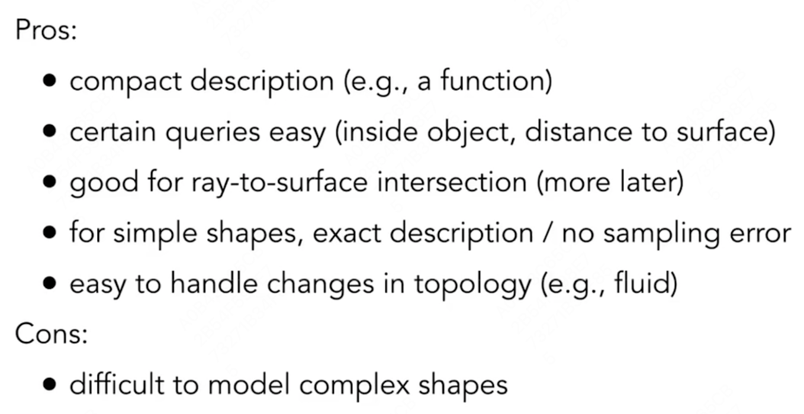
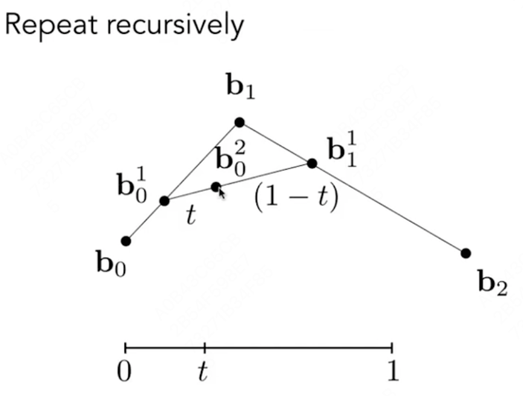
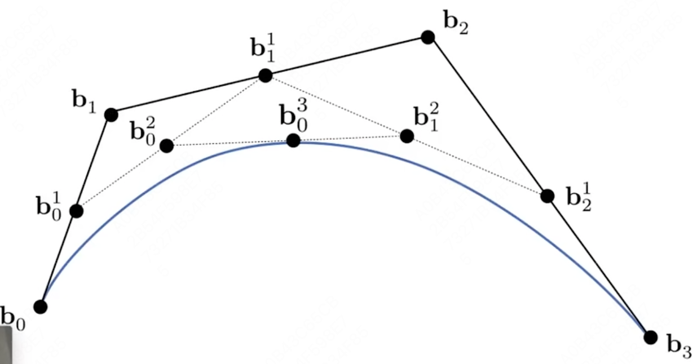
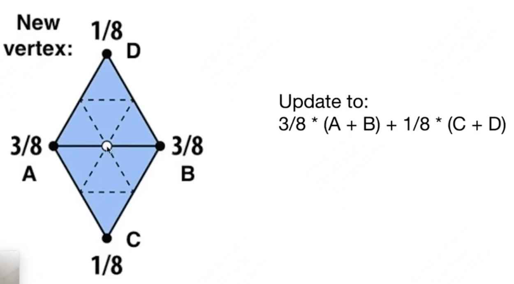
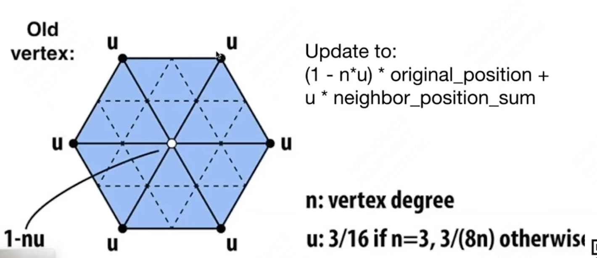
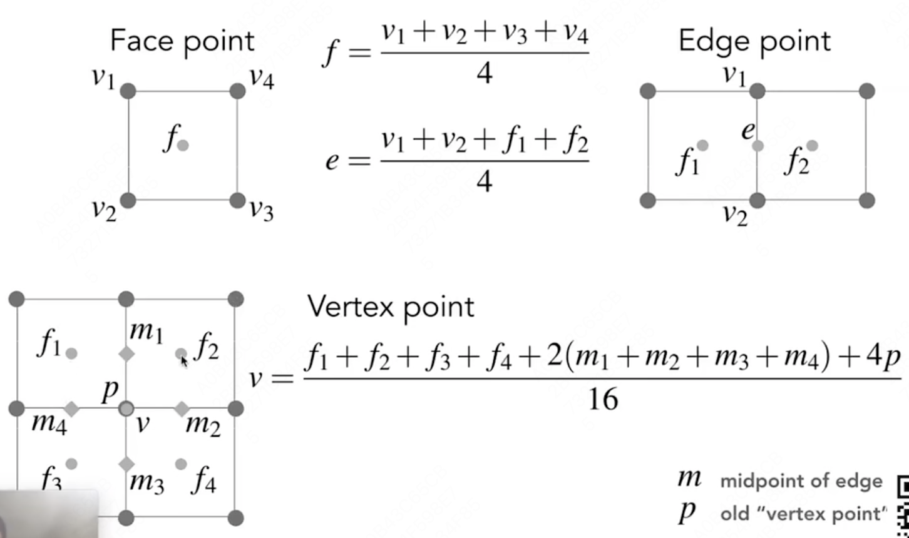

# GAMES 101：现代计算机图形学入门

## Geometry部分

课程网站：https://sites.cs.ucsb.edu/~lingqi/teaching/games101.html

本课程将全面而系统地介绍现代计算机图形学的四大组成部分：

1. 光栅化成像
2. **几何表示**
3. 光的传播理论
4. 动画与模拟

每个方面都会从基础原理出发讲解到实际应用，并介绍前沿的理论研究。通过本课程，你可以学习到计算机图形学背后的数学和物理知识，并锻炼实际的编程能力。

## Lecture 10 Geometry 1

###### Introduction 

### Ways to Represent Geometry

#### Implicit 隐式表示

给定一个关系 $f(x, y, z) = 0$ ，要求点满足这个关系。

eg. $x^2 + y^2 + z^2 = 1$，表示一个球。

- Algebraic Surfaces
- Constructive Solid Geometry：通过基本几何体的布尔运算。
- Distance Functions：可以将两个物体的距离函数混合，再恢复成原本的面。
- Level Set Methods：存储一个近似函数值的值网格。
- Fractals：分形，如雪花。

优缺点：

#### Explicit 显式表示

所有的点都直接给出，或者通过参数映射给出。

- Point Cloud：点云，(x, y, z) 的列表。扫描出来的基本为点云，考虑如何转换成mesh。
- Polygon Mesh：多边形面片。`.obj`文件，点、纹理坐标、法线、连接关系。

## Lecture 11 Geometry 2

###### Curves and Surfaces

### Curves（Bezier Curves）

使用一系列控制点（起始点、起始切线、结束点、结束切线）来定义一条曲线。

#### de Casteljau Algorithm

用于绘制一条Bezier曲线。

假设起始点$b_0$为时间0，结束点$b_2$为时间1，则对中间的某一时间t，可以按照n进行差值，从而找到一个确定的点$b_0^2$。

**Quadratic Bezier Curve：**

**Cubic Bezier Curve：**

#### Algebraic Formula（递归）

$$
b_0^1(t) = (1 - t) b_0 + t b_1\\
b_1^1(t) = (1 - t) b_1 + t b_2\\
......\\
b_0^2(t) = (1 - t) b_0^1 + t b_1^1\\
......\\
b_i^k(t) = (1 - t) b_i^{k-1} + t b_{i+1}^{k-1} 
$$

即：
$$
\mathbf{b^n}(t) = \sum_{i=0}^n \mathbf{b}_i B_i^n(t)
\\
B_i^n(t) = \binom{n}{i} t^i (1-t)^{n-i}
$$
其中$b_i$为控制点，n为控制阶数，$B(t)$为二项式系数（Bernstein polynomial）。

#### Properties of Bezier Curves 性质

- 曲线必定经过起始点、终止点
- 导数
- 不会受**仿射变换**（Affine transformation）影响，投影变换会受影响
- 凸包性质：画出来的曲线一定在控制点形成的凸包（Convex Hull，最小的外包多边形）内。

#### Piecewise Bezier Curves 逐段

在很多控制点存在的情况下，直接绘制可能会导致绘制不理想的情况。

每次使用很少的控制点（通常为4个），来逐段控制曲线。

##### Continuity

- $C^0 continuity$：$a_n = b_0$，保证点连接
- $C^1 continuity$：$a_n = b_0 = \frac{1}{2}(a_{n-1} + b_1)$ ，保证切线（导数）连续。

通常使用$C^1$连续：前一段终止点和后一段起始点的切线（由两个控制点形成的线段）长度和方向都相同。

#### Spline 样条

一个连续的曲线是由一系列控制点决定的，在任意一点都保证连续性。

##### B-splines / basic-splines

考虑到局部性的Bezier Curves。

### Surfaces（Bezier Surface）

在两个方向同时应用Bezier Curve的方法，即在水平方向得到一系列水平Bezier Curve，然后在竖直方向通过水平curve获得的点得到一系列竖直方向的Bezier Curve。

## Lecture 12 Geometry3

### Mesh Operations：Geometry Processing

- Mesh Subdivision（upsampling）：网格细分
- Mesh Simplification（downsampling）：网格简化
- Mesh Regularization（same #triangles）：正则化

### Subdivision

1. 创建更多的三角形。
2. 调整三角形位置

#### Loop Subdivision（Loop是人名）

需要三角形网格。

1. 连接一个三角形内每条边的中点，来创建更多三角形。

2. 对于调整**新顶点**（每个边的中点）：

   

3. 对于调整旧顶点（原三角形的顶点）：

   

#### Catmull-Clark Subdivision（General Mesh，多边形网格）

奇异点（Extraordinary vertex）：度不为4（degree != 4）。

1. 取每个面片的中点（Face point），将此点和该面片每一个边的中点（Edge point）相连。

   经过以上变化，通过引入更多的奇异点，来将**非四边形面片**变成四边形面片；增加的奇异点数量和原先**非四边形面片**数量相同。

2. 调整新增加的Face point

3. 调整新增加的Edge point

4. 调整旧的顶点

   

### Simplification

减少mesh元素的数量，同时保持原始形状。

#### Collapsing An Edge 边坍缩

将某些顶点合并到某一点，以减少边的数量。

**二次误差度量**（Quadric Error Metrics）：使合并后的点到各个面距离的平方和最小。

##### Simplification via Quadric Error

使用二次误差，来判断哪些边需要坍缩，哪些边不能坍缩。

从最小的二次误差开始，逐个进行坍缩；同时需要更新受坍缩影响的边的二次误差。

使用Heap。