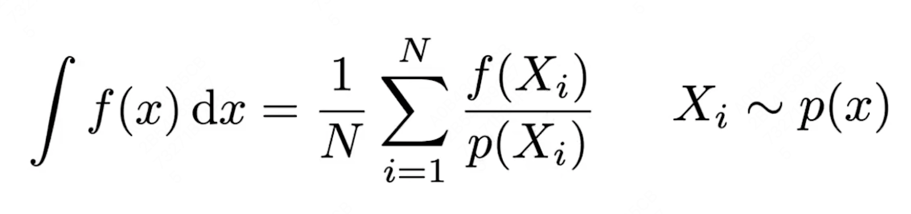

# GAMES 101：现代计算机图形学入门

## Ray Tracing部分

课程网站：https://sites.cs.ucsb.edu/~lingqi/teaching/games101.html

本课程将全面而系统地介绍现代计算机图形学的四大组成部分：

1. 光栅化成像
2. 几何表示
3. **光的传播理论**
4. 动画与模拟

每个方面都会从基础原理出发讲解到实际应用，并介绍前沿的理论研究。通过本课程，你可以学习到计算机图形学背后的数学和物理知识，并锻炼实际的编程能力。

## Lecture 13 Ray Tracing 1

###### Whitted- Style Ray Tracing

光栅化不能很好的解决全局（global）效果：

- （软）阴影
- 光的多次反射：Glossy Reflection、Indirect illumination

光栅化很快，但是质量相对较低，用作实时渲染；光线追踪更准确，但是速度非常慢，用作offline渲染。

### Basic Ray-Tracing Algorithm

**Light Rays**：

1. 光线沿直线传播。
2. 光线之间不会发生碰撞，不会相互影响。
3. 光线从光源出发，经过不断反射后进入相机（光路可逆，相机也可以追踪到光源）。

**光线投射**（Ray Casting）：

1. Generating Eye Rays：从相机出发，对屏幕某一像素点发射一条光线，找到和场景物体最近的交点，即第一折射点。
2. Shading Pixels（Local Only）：通过入射方向、光源方向、法线方向计算着色，写入像素。

**递归光线投射（Whitted- Style）**：

把所有折射、反射点的着色值都写入此像素中。

如果物体是镜面的，则光线进行折射、反射；物体不完全光滑，则光线被吸收，进行漫反射。

### Ray-Surface Intersection

**光线**（Ray）：一个起点（origin）和一个方向向量（direction）。

**光线方程**（Ray Equation）：沿光线上的任意一点 $\mathbf{r}(t) = \mathbf{o} + t\mathbf{d},\quad t\in[0,+\infty)$

#### 光线和球体求交

#### 光线和隐式物体（Implicit Surface）求交

从上面方法推广：

#### 光线和显式物体（Triangle Mesh）求交

对每个三角形面：

1. 考虑空间中光线和三角形求交：
   - 判断光线和平面求交。
   - 判断交点是否在三角形内。
2. 取最近的hit点（t最小）

**平面方程**（Plane Equation）：一个法向量（N）和平面内任意一点（p'）。对平面上任意一点p， $(\mathbf{p} - \mathbf{p}') \cdot \mathbf{N} = 0$

##### 光线和平面求交

##### Moller Trubore Algorithm

使用重心坐标，快速进行光线和三角形求交。即**光线方程==重心坐标**：

要求 $t, b_1, b_2, 1-b_1-b_2 \geq 0$ 。

#### Accelerating Ray-Surface Intersection 加速结构（AABB）

##### Bounding Volumes 包围盒

对于复杂物体，使用简单图形将其包裹。

如果一个光线碰不到包围盒，那也碰不到里面的物体。

##### Ray-Intersection With Box

长方体（box）是三对平行面的交集。

通常使用**轴对齐包围盒**（Axis-Aligned Bounding Box，AABB）。

##### 光线和AABB求交

###### 2D

2D矩形为两对平行平面的交集，可以分别求两对平行平面的$t_{min},t_{max}$ ，对两对t值求交集：

###### 3D

**与上述求交集相似，核心思路是：**

- 只有光线全部进入三对平行面形成的区域，光线才进入包围盒。
- 只要光线离开某一个区域，光线就离开了包围盒。

**所以求交步骤为：**

1. 计算每个对面的$t_{min},t_{max}$。
2. $t_{enter}=max\{t_{min}\}, t_{exit} = min\{t_{max}\}$。
3. 如果$t_{enter} < t_{exit}$，则光线与包围盒可能有交点，但是需要判断以下情况：
   - 如果$t_{exit} < 0$，则光线离开时间为负数，一定没有交点
   - 如果$t_{exit} >= 0, t_{enter} < 0$，则光线在盒子内，一定有交点。
4. 所以当且仅当$t_{enter} < t_{exit}, t_{exit} >= 0$ 时，光线和包围盒有交点。

**使用轴对齐的原因是，可以将光线和平面求交的方程简化：**

## Lecture 14 Ray Tracing 2

###### Acceleration & Radiometry

### Uniform Spatial Partitions（Grids）

1. 找到包围盒。
2. 建立格子（大小有一个平衡值）。
3. 将每个格子存在的物体存储。
4. 沿着光线经过的格子依次判断是否有物体存在，再判断是否和物体有交点。

### Spatial Partitions 空间划分

- 八叉树（Oct-Tree）：将空间平均划分成八个区域，每个区域再次划分。
- **KD-Tree**：根据某一规则不断划分，每次换一个坐标轴方向划分一次，保证了二叉树的性质。
- BSP-Tree：根据某一规则不断划分，不沿坐标轴方向，二叉树。

#### KD-Tree Pre-Processing

对于任何一个节点，需要存储

- split axis：沿哪个轴进行划分，x、y、z
- split position：划分的位置，即在划分轴上的坐标
- children：子节点
- 实际的物体只存在于叶子结点上

存在问题是，划分的边界问题和物体的切割问题。

### Object Partitions & Bounding Volume Hierarchy（BVH）

#### 做法

1. 找到一个包围盒。
2. 递归的将包围盒中的物体分为两个部分。
3. 重新计算两个部分的包围盒。
4. 当叶子结点内有足够少的三角形就停止。

可以保证物体只在一个盒子里；但是划分的包围盒有可能重叠。

#### Building BVHs

##### 划分结点的方式

- 选择不同的维度（坐标轴）进行划分。
- 选择包围盒最长的轴进行划分。
- 在中间的（个数）物体进行划分。

##### BVHs的数据结构

- 中间结点
  - 包围盒
  - 子结点
- 叶子结点
  - 包围盒
  - 存储的物体列表

### Basic Radiometry 辐射度量学

######   高级光线追踪

**Radiometry**

准确的度量光照，定义了光照的各种属性：

- **Radiant Energy**：电磁辐射的能量（焦耳 J）。
- **Radiant Flux（Power）**：单位时间的能量，功率（瓦特 W，流明 lm = lumen），光通量。
- **Intensity**：一个光源向周围辐射了多少能量。
- **Irradiance**：一个物体表面接受了多少能量。
- **Radiance**：光在传播过程中的能量。

#### Radiant Intensity

单位立体角（solid angle）辐射出的能量

##### Angles and Solid Angles 立体角

**angle**：弧长 / 半径

**solid angle**： 球面面积 / 半径平方，$\Omega = \frac{A}{r^2}$，球有4π立体角

若一个点光源向各个方向均匀辐射能量，则每个单位立体角辐射的能量为$I = \frac{\phi}{4\pi}$。

##### Differential Solid Angles 微分立体角

$\theta、\phi$各变化一下部分所产生的立体角的变化。

#### Irradiance

单位面积所接收的能量，面积需要与光线垂直（乘 $cos\theta$）。

#### Radiance

描述光线在单位立体角、单位面积的能量，两次微分。

本质上是考虑一个微小的面，在一个微小的方向发出的能量。

接合前面的概念，可以得到两个不同方向的新概念：

- **Incident Radiance**： 单位立体角的Irradiance，即单位面积所接收的入射单位立体角的能量。

  

- **Exiting Radiance**：单位面积上的Intensity，即单位面积在某一立体角发射出去的能量。

  

Irradiance是单位面积接收的所有能量；Radiance是单位面积从某一方向接收的能量。

Irradiance是Radiance对立体角的积分；Radiance是Irradiance对立体角的微分。

## Lecture 15 Ray Tracing 3

###### Light Transport & Global Illumination

### Bidirectional Reflectance Distribution Function（BRDF）双向反射分布函数

#### BRDF

光线从某个方向进入，并且反射到某个方向的能量；光线照射到物体，物体吸收光线，物体发射光线。定义了不同的材质。

#### The Reflection Equation 反射方程

对一个点（极小的面积）而言，其接收各个方向（半球）的光照后，向某一方向反射的光强。

是一个递归的定义，因为需要考虑来自各个方向光照（不局限于光源）。

#### The Rendering Equation 渲染方程

一个物体的出射光线由两部分组成：

- 自发光
- 吸收并反射的光（）反射方程

$$
I(u) = e(u) + \int{I(v)K(u,v)dv}\\
$$
其中$I(v)$为输入，$I(u)$为输出，其他量已知，$K(u,v)dv$ 是 **Kernel of Equation**。

#### Global Illumination 全局光照

将上面渲染方程简化为算子形式：$L = E + KL$

使用级数展开，将看到的光源展开为：

- 0次反射：光源自发光
- 1次反射：直接光照，光源->物体->相机
- 2次反射、...、n次反射：间接光照，光源->物体->物体->...->相机

的和，其中**全局光照 = 直接光照 + 间接光照**。

而光栅化方法的着色只能实现0、1次反射。

## Lecture 16 Ray Tracing 4

###### Monte Carlo Path Tracing

### Monte Carlo Integration 积分

**目的**：给定一个复杂函数，计算其定积分的值。

**做法**：在函数内进行多次采样，使用采样点的值代替函数值（长方形），使用得到的长方形结果的平均值代替定积分的值。

**采样方式**：通过概率分布函数进行采样（PDF）。

- 样本越多，误差越小
- 对x采样，对x积分

### Path Tracing 路径追踪

使用Monte Carlo解渲染方程，其中概率$p(w_i)$在半球均匀分布为$\frac{1}{2\pi}$：

#### 全局光照

对物体表面对点进行采样：黑色部分为直接光照，蓝色部分为间接光照

#### 解决指数爆炸问题

只随机采样一根光线（方向），来避免$O(n^n)$复杂度

##### 像素光线生成

对物体的一个点来说，只采样一根光线噪声很大；但是对一个像素来讲，会有足够多的path穿过这个像素（重叠），从而减少了噪声的影响。

#### 解决递归无法退出问题

使用**俄罗斯轮盘赌**（Russian Roulette，RR）方法，使用一定的概率$P$去停止追踪。即使用$L_o / P$ 当作能量。

#### 对光源采样

将渲染方程$dw$，改写成对光源面积$dA$的积分。

改写积分后，使用Monte Carlo解渲染方程，其中概率$p(A_i)$在光源面积内平均分布为$\frac{1}{A}$。

所以对一个物体上的点：

- 来自光源的直接光照，使用光源采样。
- 来此其他物体反射的间接光照，使用RR方法。

##### 解决直接光照被遮挡的问题

