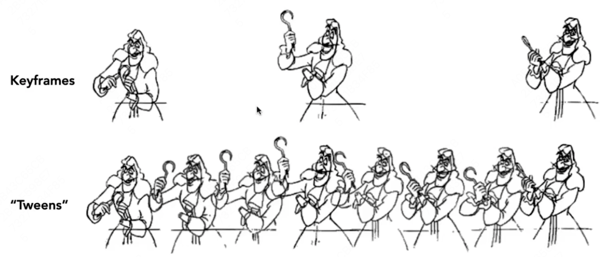
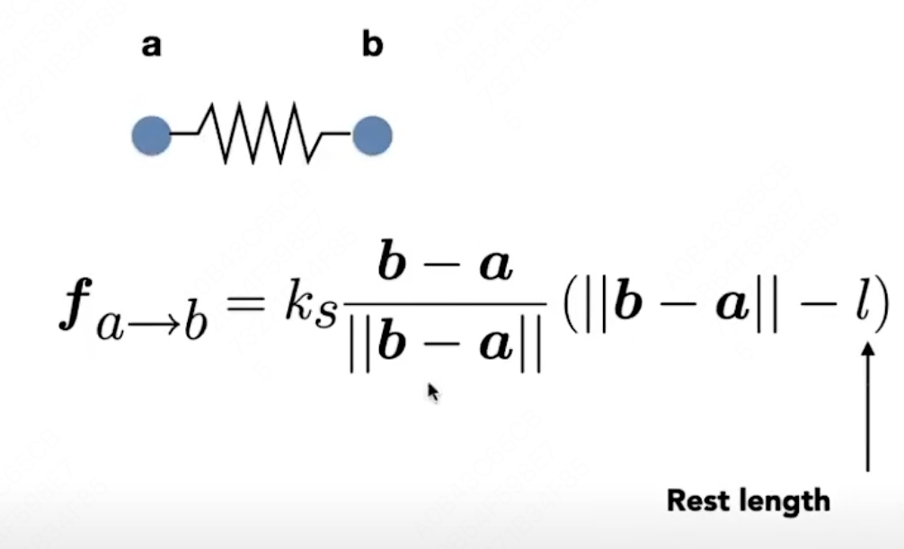
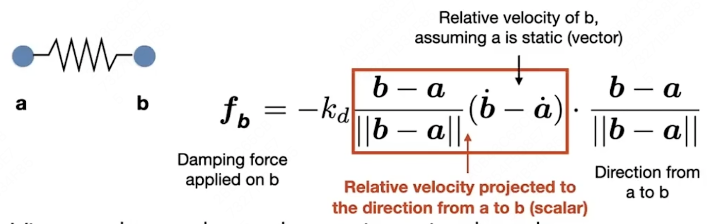
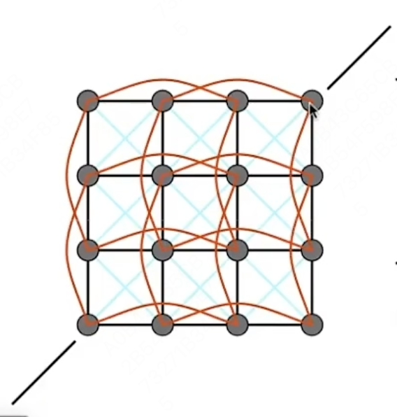

# GAMES 101：现代计算机图形学入门

## Animation & Simulation部分

课程网站：https://sites.cs.ucsb.edu/~lingqi/teaching/games101.html

本课程将全面而系统地介绍现代计算机图形学的四大组成部分：

1. 光栅化成像
2. 几何表示
3. 光的传播理论
4. **动画与模拟**

每个方面都会从基础原理出发讲解到实际应用，并介绍前沿的理论研究。通过本课程，你可以学习到计算机图形学背后的数学和物理知识，并锻炼实际的编程能力。

## Lecture 21 Animation 1

### Keyframe Animation 关键帧动画

使用关键帧插值。

### Physical Simulation 物理仿真

建立物理模型。

#### Mass Spring Rope 质点弹簧系统

##### 弹簧弹力

- 相对距离
- 弹性系数

##### 弹簧内部摩擦力

红色部分为a、b相对速度沿弹簧方向的投影大小。

- 相对速度
- 摩擦系数

#### 布料模拟

在原有质点弹簧系统中加入更多的弹簧，来完善布料的性质，抵抗任意方向的折叠（红色）、拉伸（蓝色）。

#### Inverse Kinematics 逆运动学

通过关节末端的位置，判断关节的角度。

#### Rigging 形状控制

使用一系列控制点，来实现物体形状、造形的控制。

#### Motion Capture 动作捕捉

- 控制点，相机捕捉
- 机械装置

## Lecture 22 Animation 2

