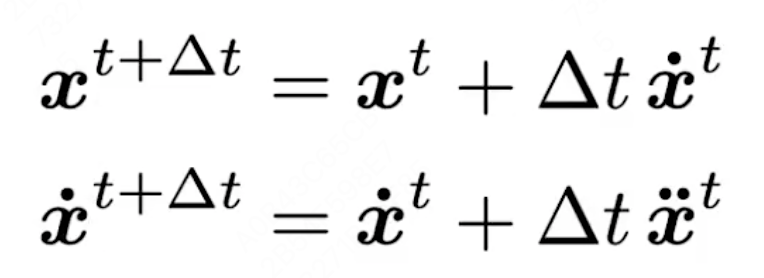
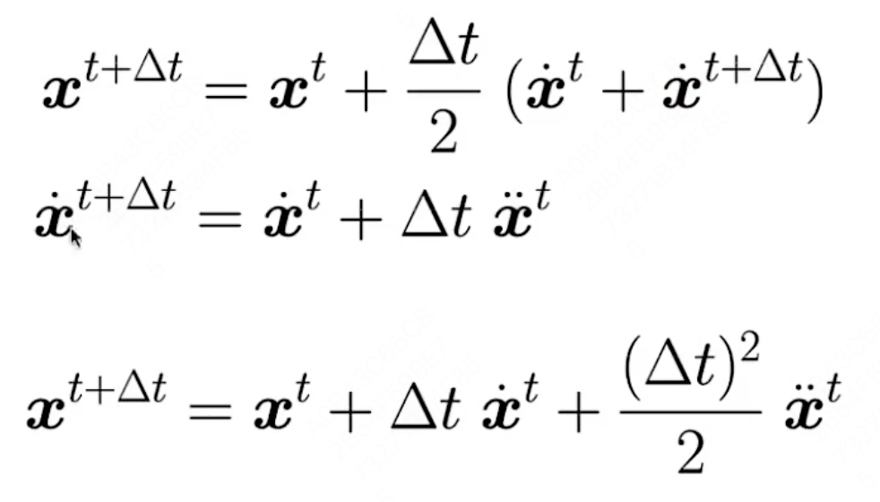
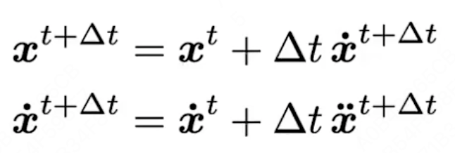
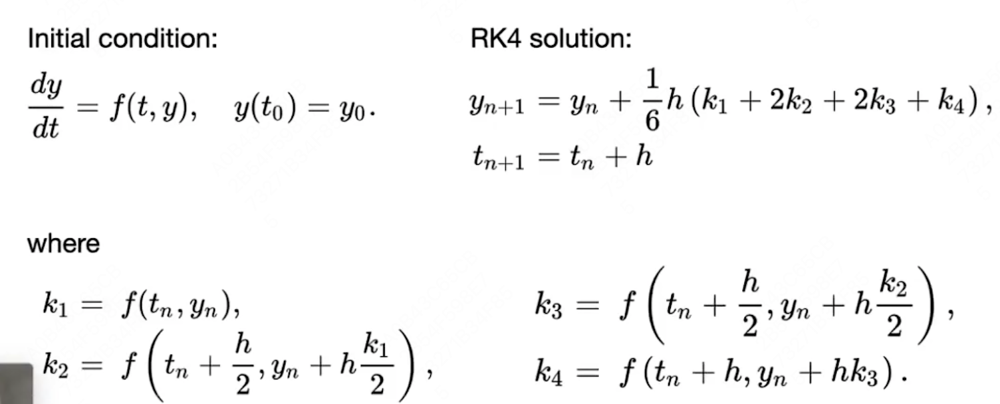

# GAMES 101：现代计算机图形学入门

## Animation & Simulation部分

课程网站：https://sites.cs.ucsb.edu/~lingqi/teaching/games101.html

本课程将全面而系统地介绍现代计算机图形学的四大组成部分：

1. 光栅化成像
2. 几何表示
3. 光的传播理论
4. **动画与模拟**

每个方面都会从基础原理出发讲解到实际应用，并介绍前沿的理论研究。通过本课程，你可以学习到计算机图形学背后的数学和物理知识，并锻炼实际的编程能力。

## Lecture 21 Animation 1

### Keyframe Animation 关键帧动画

使用关键帧插值。

### Physical Simulation 物理仿真

建立物理模型。

#### Mass Spring Rope 质点弹簧系统

##### 弹簧弹力

- 相对距离
- 弹性系数

##### 弹簧内部摩擦力

红色部分为a、b相对速度沿弹簧方向的投影大小。

- 相对速度
- 摩擦系数

#### 布料模拟

在原有质点弹簧系统中加入更多的弹簧，来完善布料的性质，抵抗任意方向的折叠（红色）、拉伸（蓝色）。

#### Inverse Kinematics 逆运动学

通过关节末端的位置，判断关节的角度。

#### Rigging 形状控制

使用一系列控制点，来实现物体形状、造形的控制。

#### Motion Capture 动作捕捉

- 控制点，相机捕捉
- 机械装置

## Lecture 22 Animation 2

###### 物理模拟实操

### Euler's Method 欧拉方法（前向）

通过上一次迭代结果求本次迭代的结果。

- 误差会累积，精度和$\Delta t$大小强相关。
- 不稳定，出现diverge现象，即不论$\Delta t$大小，都与预期有很大区别。

### Combating Instability 解决不稳定问题

#### Midpoint Method 中点法

#### Adaptive Step Size 自适应步长

#### Implicit Euler Method 隐式欧拉（后项）

#### Runge-Kutta Families 龙格法

##### RK4 四阶龙格

#### Position-Based / Verlet Integration 非基于物理方法

直接对物体调整位置。

- 速度快、计算简单
- 不基于物理，非能量守恒

##### Rigid Body Simulation 刚体模拟

- 和粒子模拟类似
- 考虑更多的物理量

##### 基于位置的流体模拟

- 假设流体是很多刚体小球组成
- 认为流体在任何情况都是不可压缩的（密度为常数），所以可以获得任何时刻、空间的流体密度。
- 通过移动刚体小球，使得密度与静止状态密度相同，修正密度变化。
- 需要考虑密度梯度，进行梯度下降。

对大规模物体（刚体小球）两种模拟方法：

- **拉格朗日方法（质点法）**：模拟所有物体的状态
- **欧拉方法（网格法）**：将空间切分为网格，模拟网格状态
